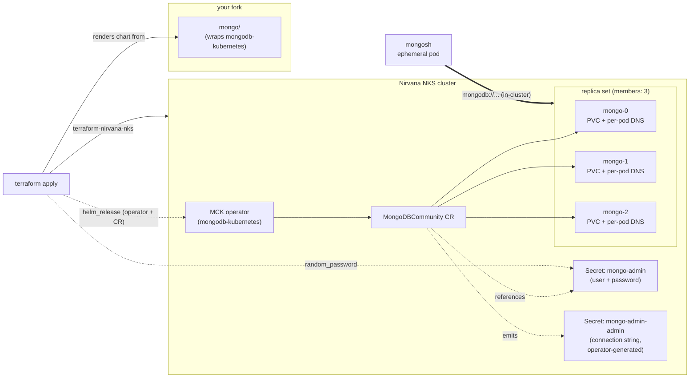

<div align="center">
  <a href="https://nirvanalabs.io">
    
  </a>

  [Sign Up](https://nirvanalabs.io/sign-up) · [Docs](https://docs.nirvanalabs.io) · [API](https://docs.nirvanalabs.io/api) · [Examples](https://github.com/nirvana-labs-examples) · [Terraform](https://registry.terraform.io/providers/nirvana-labs/nirvana/latest) · [TypeScript SDK](https://www.npmjs.com/package/@nirvana-labs/nirvana) · [Go SDK](https://github.com/Nirvana-Labs/nirvana-go) · [CLI](https://github.com/nirvana-labs/nirvana-cli) · [MCP](https://www.npmjs.com/package/@nirvana-labs/nirvana-mcp)
</div>

---

# MongoDB on NKS

Starter example for deploying [MongoDB](https://www.mongodb.com) on a Nirvana Labs NKS cluster, following MongoDB Inc.'s recommended Kubernetes deployment shape via the [MongoDB Controllers for Kubernetes (MCK)](https://github.com/mongodb/mongodb-kubernetes) operator.

> 3-member replica set on persistent volumes, in-cluster connectivity only. Not production-ready — see "Going further" for sharded clusters, TLS on the wire, off-cluster access patterns, and Atlas-managed alternatives.

## Architecture



## Prerequisites

- [Terraform](https://www.terraform.io/downloads.html) ≥ 1.5
- [kubectl](https://kubernetes.io/docs/tasks/tools/) + [helm](https://helm.sh/docs/intro/install/)
- A [Nirvana Labs API key](https://dashboard.nirvanalabs.io/)
- A fork of this repo

## Quick start

1. **Fork this repo** on GitHub. Clone your fork locally.

2. **Fetch chart dependencies** — `charts/` is gitignored, so the upstream MCK chart needs to be fetched once per clone:

   ```bash
   helm dependency build mongo/
   ```

3. **Set required variables:**

   ```bash
   export NIRVANA_LABS_API_KEY=<your key>
   export TF_VAR_project_id=<your project id>
   ```

4. **First apply** — creates the cluster only:

   ```bash
   cd terraform
   terraform init
   terraform apply -target=module.nks
   ```

   `-target` scopes this apply to cluster provisioning so the Kubernetes/Helm providers (which need a kubeconfig that doesn't exist yet) aren't invoked. Wait ~10 minutes for the control plane.

5. **Second apply** — installs the MCK operator and the replica set:

   ```bash
   export TF_VAR_fetch_kubeconfig=true
   terraform apply
   ```

   The operator takes ~2–3 minutes after `helm_release` returns to elect a primary and generate the connection-string Secret. If the first apply finishes before the Secret is generated, re-run `terraform apply` once.

6. **Verify** — see [Connecting from in-cluster pods](#connecting-from-in-cluster-pods) below for the canonical retrieve-and-smoke-test flow. The Terraform path also exposes a convenience output:

   ```bash
   export KUBECONFIG=$(terraform output -raw kubeconfig_path)
   eval "$(terraform output -raw mongo_test_cmd)"
   # expect: { isWritablePrimary: true, ... members: 3 ... }
   ```

## Connecting from in-cluster pods

The operator auto-generates a connection-string Secret (`mongo-admin-admin`) with the canonical URI. The URI embeds the password, so this is the authoritative retrieval surface regardless of how you installed (Terraform / manual helm / ArgoCD) — it remains valid even after the bootstrap `mongo-admin` Secret is deleted per the vendor's [Next Steps](https://github.com/mongodb/mongodb-kubernetes/blob/main/docs/mongodbcommunity/users.md#next-steps).

Retrieve:

```bash
kubectl get secret mongo-admin-admin -n mongo \
  -o jsonpath='{.data.connectionString\.standard}' | base64 -d
```

The URI looks like:

```
mongodb://admin:<pwd>@mongo-0.mongo-svc.mongo.svc.cluster.local:27017,mongo-1.mongo-svc...:27017,mongo-2.mongo-svc...:27017/admin?replicaSet=mongo&ssl=false
```

Consume it as `envFrom` / a volume mount in your application pods — the driver does replica-set discovery via the headless Service automatically.

Smoke test with an ephemeral `mongosh` pod:

```bash
URI=$(kubectl get secret mongo-admin-admin -n mongo \
  -o jsonpath='{.data.connectionString\.standard}' | base64 -d)
kubectl run -it --rm mongosh --image=mongo:8.0 --restart=Never -- \
  mongosh "$URI" --eval 'db.runCommand({hello: 1})'
# expect: { isWritablePrimary: true, ... members: 3 ... }
```

## Why in-cluster only

A single `LoadBalancer` Service in front of a replica set doesn't preserve replica-set semantics: the driver's `hello` discovery returns per-pod in-cluster DNS names that off-cluster clients can't resolve. For off-cluster access — the vendor's pattern uses [`replSetHorizons`](https://www.mongodb.com/docs/manual/reference/replica-configuration/#mongodb-rsconf-rsconf.members-n-.horizons) + per-member endpoints with split-horizon DNS:

- MongoDB Kubernetes Operator docs: <https://www.mongodb.com/docs/kubernetes-operator/current/>
- `replSetHorizons` reference: <https://www.mongodb.com/docs/manual/reference/replica-configuration/#mongodb-rsconf-rsconf.members-n-.horizons>

For a simpler off-cluster path, run a VPN into the VPC + DNS forwarding for `*.svc.cluster.local`. See [nirvana-labs-examples/wireguard-vpn](https://github.com/nirvana-labs-examples/wireguard-vpn).

## Alternative install paths

### Manual helm (any cluster)

Install the vendor's operator chart directly, pre-create the admin Secret, then apply your own `MongoDBCommunity` CR per the vendor's Quick Start:

```bash
# 1. Install the MCK operator
helm repo add mongodb https://mongodb.github.io/helm-charts
kubectl create namespace mongo
helm install mongo-operator mongodb/mongodb-kubernetes -n mongo

# 2. Pre-create the admin password Secret (the MongoDBCommunity CR's
#    users[].passwordSecretRef will reference it). MCK does not auto-
#    generate passwords — this is the vendor-recommended path; see
#    https://github.com/mongodb/mongodb-kubernetes/blob/main/docs/mongodbcommunity/users.md
kubectl create secret generic mongo-admin -n mongo \
  --from-literal=password=$(openssl rand -hex 16)

# 3. Apply a MongoDBCommunity CR — see vendor Quick Start for a sample:
#    https://github.com/mongodb/mongodb-kubernetes/blob/main/docs/community-search/quick-start.md
```

After the replica set reaches `Phase: Running`, retrieve the connection string and verify per [Connecting from in-cluster pods](#connecting-from-in-cluster-pods). MongoDB recommends deleting the bootstrap `mongo-admin` Secret at that point — the operator caches SCRAM credentials internally and no longer needs the plaintext password (see [Next Steps](https://github.com/mongodb/mongodb-kubernetes/blob/main/docs/mongodbcommunity/users.md#next-steps)). The connection-string Secret (`mongo-admin-admin`) persists, so retrieval keeps working.

### Existing ArgoCD installation

If you already followed [nirvana-labs-examples/argocd-gitops-nks](https://github.com/nirvana-labs-examples/argocd-gitops-nks), adding MongoDB is a copy-and-push:

1. Copy `mongo/` from this repo into `argocd/mongo/` in your argocd-gitops-nks fork.

2. Pre-create the admin Secret in the `mongo` namespace (the `MongoDBCommunity` CR's `users[].passwordSecretRef` references it — MCK does not auto-generate passwords; this is the [vendor-recommended pattern](https://github.com/mongodb/mongodb-kubernetes/blob/main/docs/mongodbcommunity/users.md#create-a-user-secret)):

   ```bash
   kubectl create namespace mongo
   kubectl create secret generic mongo-admin -n mongo \
     --from-literal=password=$(openssl rand -hex 16)
   ```

   For production, replace the manual `kubectl create secret` with your secrets pipeline (sealed-secrets, ESO, etc.) — the operator only needs the Secret to exist with key `password` before reconciliation. Per the vendor's [Next Steps](https://github.com/mongodb/mongodb-kubernetes/blob/main/docs/mongodbcommunity/users.md#next-steps), the bootstrap Secret can be deleted after the cluster reaches `Phase: Running`. Once reconciled, retrieve the connection string and verify per [Connecting from in-cluster pods](#connecting-from-in-cluster-pods).

3. Commit and push.

The `workloads` ApplicationSet in argocd-gitops-nks auto-discovers the new directory and generates an `Application` for it on its next refresh (~3 minutes by default).

## Going further

- **Bigger replica sets / sharded clusters**: [MongoDB Kubernetes Operator docs](https://www.mongodb.com/docs/kubernetes-operator/current/) — bump `members`, add shards, configure arbiters, etc.
- **TLS on the wire**: configure `MongoDBCommunity.spec.security.tls` and wire certificates via cert-manager — see [Secure Client Connections](https://www.mongodb.com/docs/kubernetes-operator/current/tutorial/secure-client-connections/).
- **Off-cluster access**: `replSetHorizons` + SRV records (linked above).
- **Backups**: vendor's [Ops Manager integration](https://www.mongodb.com/docs/ops-manager/current/) (Enterprise / paid) or PVC snapshots via your storage backend.
- **Atlas (managed)**: <https://www.mongodb.com/atlas> if you'd rather not self-host.
- **Pure-FOSS alternatives** if MongoDB's SSPL is a concern:
  - [Percona Server for MongoDB](https://www.percona.com/mongodb/software/percona-server-for-mongodb) — Apache 2 fork
  - [FerretDB](https://www.ferretdb.com/) — PostgreSQL-backed, wire-protocol-compatible

## Cleanup

```bash
cd terraform
terraform destroy
```

## License

Apache 2.0 — see [LICENSE](LICENSE).
